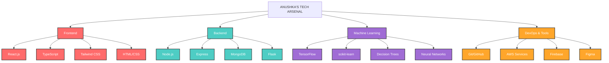

<div align="center">
  
</div>

<br>

```ascii
 █████╗ ███╗   ██╗██╗   ██╗███████╗██╗  ██╗██╗  ██╗ █████╗     ███████╗██╗  ██╗███████╗███╗   ██╗██████╗  ██████╗ ███████╗
██╔══██╗████╗  ██║██║   ██║██╔════╝██║  ██║██║ ██╔╝██╔══██╗    ██╔════╝██║  ██║██╔════╝████╗  ██║██╔══██╗██╔════╝ ██╔════╝
███████║██╔██╗ ██║██║   ██║███████╗███████║█████╔╝ ███████║    ███████╗███████║█████╗  ██╔██╗ ██║██║  ██║██║  ███╗█████╗  
██╔══██║██║╚██╗██║██║   ██║╚════██║██╔══██║██╔═██╗ ██╔══██║    ╚════██║██╔══██║██╔══╝  ██║╚██╗██║██║  ██║██║   ██║██╔══╝  
██║  ██║██║ ╚████║╚██████╔╝███████║██║  ██║██║  ██╗██║  ██║    ███████║██║  ██║███████╗██║ ╚████║██████╔╝╚██████╔╝███████╗
╚═╝  ╚═╝╚═╝  ╚═══╝ ╚═════╝ ╚══════╝╚═╝  ╚═╝╚═╝  ╚═╝╚═╝  ╚═╝    ╚══════╝╚═╝  ╚═╝╚══════╝╚═╝  ╚═══╝╚═════╝  ╚═════╝ ╚══════╝
```

<div align="center">
  <h3>⚡ THE MERN WIZARD | ML EXPLORER ⚡</h3>
</div>

---

## THE JOURNEY SO FAR

<table border="0">
 <tr>
    <td width="50%">
      
    </td>
    <td width="50%">
      <h3>DIGITAL CRAFTSMAN 👩‍💻</h3>
      <blockquote>
        I'm not just a coder, I'm a digital architect weaving solutions across the tech landscape. From mental health platforms to real-time collaboration tools, I build with purpose.
      </blockquote>
      <ul>
        <li>🧠 <b>Computer Science Student</b> with an appetite for innovation</li>
        <li>🔮 Turning coffee into code and ideas into reality</li>
        <li>🏆 <b>8x Hackathon Champion</b> across multiple domains</li>
        <li>📈 <b>Full Stack Developer</b> who loves bridging creativity with functionality</li>
      </ul>
    </td>
 </tr>
</table>

---

<div align="center">
  <h2>🎮 SKILLS DASHBOARD</h2>
</div>



---

<div align="center">
  <h2>🏆 CONQUEST CHRONICLES: HACKATHON VICTORIES</h2>
</div>

<div align="center" style="display: grid; grid-template-columns: repeat(auto-fit, minmax(300px, 1fr)); gap: 15px; margin: 20px 0;">

  <div style="background: linear-gradient(145deg, #FFD700, #FFA500); border-radius: 10px; padding: 15px; margin: 5px;">
    <h3>🥇 AIRAVAT HACKATHON 2025</h3>
    <p>1st Place | National Level | IEEE CS at SPIT</p>
  </div>
  
  <div style="background: linear-gradient(145deg, #FFD700, #FFA500); border-radius: 10px; padding: 15px; margin: 5px;">
    <h3>🥇 LEVEL-UP HACKATHON 2025</h3>
    <p>1st Place | KJ Somaiya Institute of Technology</p>
  </div>
  
  <div style="background: linear-gradient(145deg, #FFD700, #FFA500); border-radius: 10px; padding: 15px; margin: 5px;">
    <h3>🥇 CODE CRAFTERS 2.0</h3>
    <p>1st Place | Hackathon Champion</p>
  </div>
  
  <div style="background: linear-gradient(145deg, #FFD700, #FFA500); border-radius: 10px; padding: 15px; margin: 5px;">
    <h3>🥇 HACKANOVA 5.0</h3>
    <p>1st Place in AIML Domain | National Level</p>
    <p>Thakur College of Engineering and Technology</p>
  </div>
  
  <div style="background: linear-gradient(145deg, #C0C0C0, #A9A9A9); border-radius: 10px; padding: 15px; margin: 5px;">
    <h3>🥈 LOGITHON HACKATHON</h3>
    <p>Runners Up | Softlink Global with IEOR, IIT Bombay</p>
  </div>
  
  <div style="background: linear-gradient(145deg, #C0C0C0, #A9A9A9); border-radius: 10px; padding: 15px; margin: 5px;">
    <h3>🥈 EAST INDIA BLOCKCHAIN SUMMIT</h3>
    <p>2nd Place | EIBS 2025 at IIT Kharagpur</p>
  </div>
  
  <div style="background: linear-gradient(145deg, #CD7F32, #A0522D); border-radius: 10px; padding: 15px; margin: 5px;">
    <h3>🥉 TECHNITUDE GLOBAL HACKATHON</h3>
    <p>2nd Runners Up | SP Jain School of Global Management</p>
  </div>
  
  <div style="background: linear-gradient(145deg, #CD7F32, #A0522D); border-radius: 10px; padding: 15px; margin: 5px;">
    <h3>🥉 ODOO HACKATHON 2025</h3>
    <p>2nd Runners Up | Gujarat Vidyapeeth</p>
  </div>
</div>

---

<div align="center">
  <h2>👾 CURRENT QUESTS</h2>
  
  <table width="100%">
    <tr>
      <td align="center" width="33%">
        
        <h3>Collaborative Text Editor</h3>
        <p>Monaco Editor + Liveblocks</p>
      </td>
      <td align="center" width="33%">
        
        <h3>Offline SOS App</h3>
        <p>React Native + Bluetooth</p>
      </td>
      <td align="center" width="33%">
        
        <h3>Emotion-Responsive UI</h3>
        <p>TensorFlow.js + React</p>
      </td>
    </tr>
  </table>
</div>

---

<div align="center">
  <h2>📊 BATTLE STATS</h2>
</div>

<table border="0">
 <tr>
    <td width="50%">
      
    </td>
    <td width="50%">
      
    </td>
 </tr>
</table>

---

<div align="center">
  <h2>🔮 THE TECH ORACLE SAYS</h2>
  
  <blockquote style="font-style: italic; font-size: 18px; color: #A06CD5;">
    "I code to build the future 💫<br>
    Let's innovate, collaborate, and break things (the good kind)."
  </blockquote>
</div>

---

<div align="center">
  <h2>🌐 COMMUNICATION PORTALS</h2>
  
  <a href="https://www.linkedin.com/in/anushka-shendge-71642a277/" style="text-decoration: none; margin: 0 10px;">
    
  </a>
  <a href="https://github.com/AnushkaShendge" style="text-decoration: none; margin: 0 10px;">
    
  </a>
  <a href="mailto:anushkashendge5@gmail.com" style="text-decoration: none; margin: 0 10px;">
    
  </a>
</div>

<br>

<div align="center">
  
</div>

<br>

<div align="center">
  
</div>
